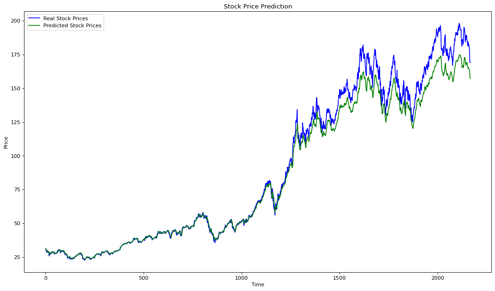
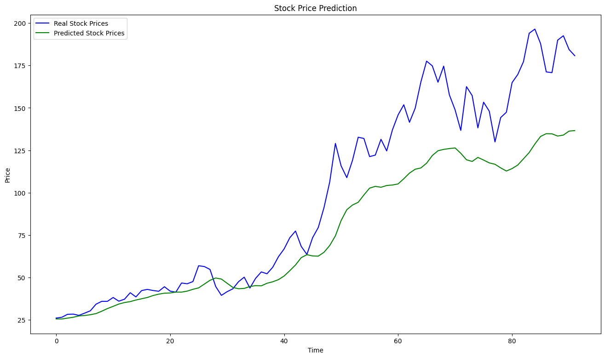
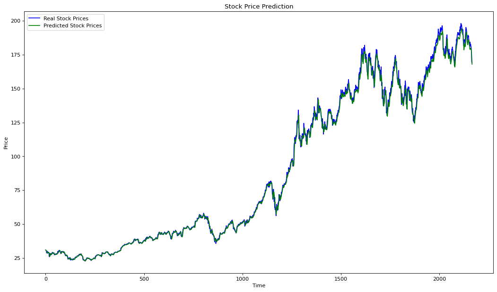
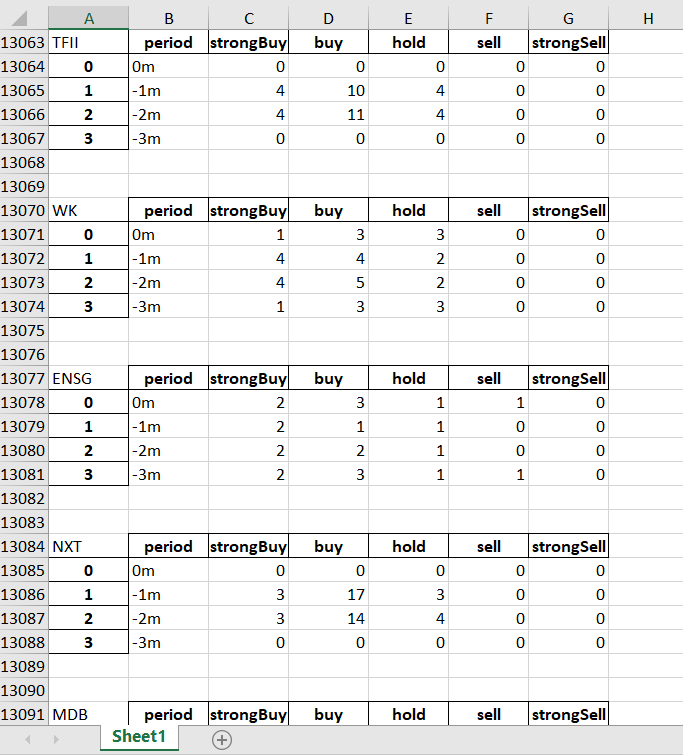
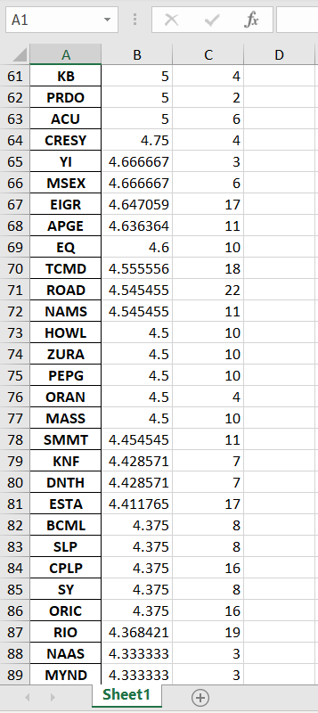

# Stock Price Prediction with LSTM 
Includes LSTM models that predicts prices for a stock based on time-step sequences, trained based on  20 years of data of **Open, High, Low, Close, Adj Close and Volume** values for a company. (I added one model that only use Close prices since it reduces noise and gives pretty decent results, around 0. 00078 MSE.) It also shows predicting models accuracy difference between monthly seperated dataset and daily one.  (One model uses monthly data whereas other uses daily.)
# Recommendations from Analysts
Since ML models can not be of use when forecasting the future price for a stock share due to vast vagueness of financial markets, i made a silly project using Yfinance's recommendation method out of curiosity. 

Fairly straightforward, it gets number of sell and buy advices from analysts in the dataset, weights it based on its date and generates a recommendation score. 
# Used Tools
`yfinance`

`Tensorflow - Keras`

`NumPy`

`Matplotlib`

`Pandas`

`Scikit-learn`

## Graphs

## Note 

Please remind this is not a financial advice, -fair enough, it eventually shows why model can not be trusted in real-life financial solutions- rather a demonstration on what is possible with fairly simple LSTM models.

### 

## Note 2!?!

I want to provide more in-depth explanation and commentary here when i have the time. ✌️

### 

## Contact Info

Email: erenemrekistin@gmail.com
LinkedIn: https://www.linkedin.com/in/erenemrekistin/

